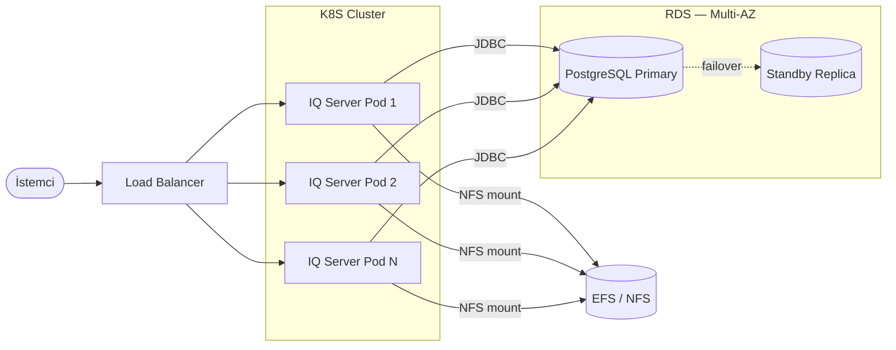

# Sonatype IQ Server — HA Altyapı Gereksinimleri

## Mimari Diyagram

---

## Pod Kaynakları (pod başına)

| Kaynak | Değer |
|---|---|
| CPU request | 4 core |
| CPU limit | 6 core |
| Memory request | 16 Gi |
| Memory limit | 24 Gi |
| Java Heap | `-Xms24g -Xmx24g` |

---

## Karşılanan Kapasite

| Mod | Dakikada Tarama | Günlük Kapasite | Başarısız Tarama |
|---|---|---|---|
| Normal | 60 RPM | ~86.400 | 0 |
| Yüksek | 120 RPM | ~172.800 | 0 |

> **Ortalama tarama süresi:** 8–10 saniye — *Performance Benchmarks*

---

## PostgreSQL Gereksinimleri

| Özellik | Değer |
|---|---|
| Instance | db.m5.4xlarge |
| CPU | 16 vCPU |
| RAM | 64 GB |
| Engine | PostgreSQL 13+ |
| Depolama | 50 GB (başlangıç) |

---

## NFS / Shared Storage Gereksinimleri

- Tüm pod'ların erişebildiği **shared NFS storage** zorunludur (NFSv4 desteklenir) - 500 GB
- Amazon EFS performansına yakın bir NFS PV önerilir (**~100 MiB/s** provisioned throughput)
- Her pod aynı filesystem path'inden mount etmelidir
- **SCM source-control dizini** mutlaka shared storage üzerinde olmalıdır
